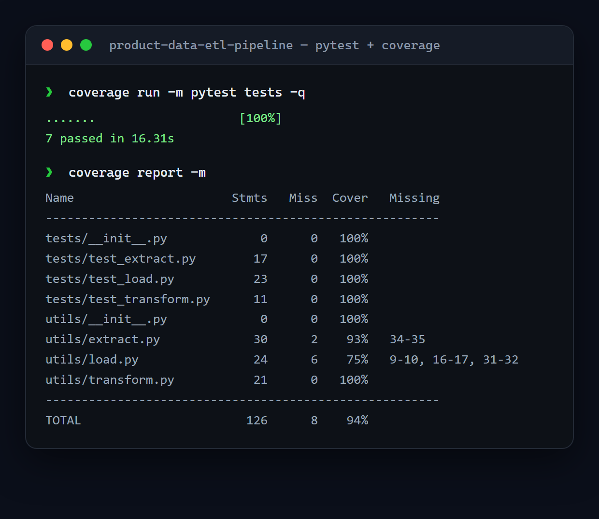

# Product Data ETL Pipeline

A modular **ETL pipeline** in Python — **extract** product data, **transform** and clean it, then **load** it to a CSV — with a full pytest suite at **94% coverage**.

<p align="center">
  
</p>

## Pipeline

```
extract  →  transform  →  load
```

- **Extract** (`utils/extract.py`) — pulls the raw product data from the source.
- **Transform** (`utils/transform.py`) — cleans and normalizes it into a tidy structure.
- **Load** (`utils/load.py`) — writes the result to `products.csv`.

`main.py` wires the three stages together into a single runnable pipeline.

## Run it

```bash
cd submission-pemda
pip install -r requirements.txt

python main.py                       # run the ETL pipeline
coverage run -m pytest tests         # run the tests
coverage report -m                   # coverage summary
```

## Tech stack

Python · pandas · requests · BeautifulSoup · SQLAlchemy · pytest · coverage

## Notes

Submission for Dicoding's *Belajar Fundamental Pemrosesan Data*. The pipeline is structured as importable `utils/` modules, each covered by its own test module.
